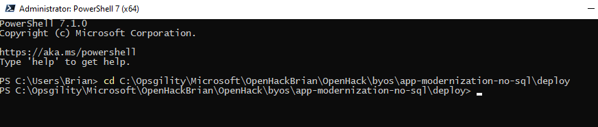
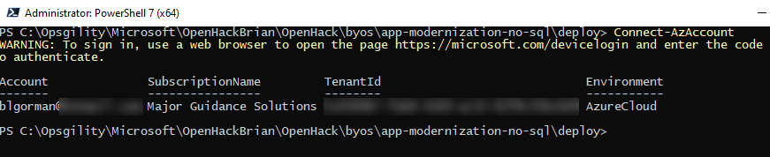
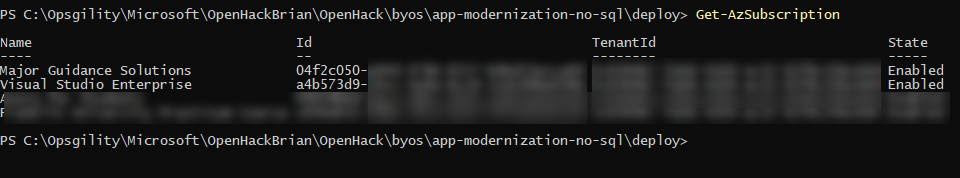
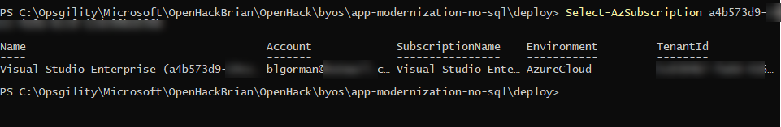
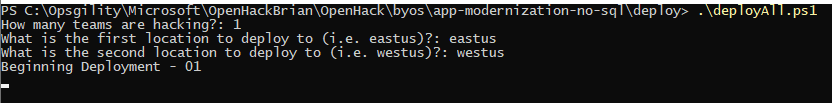
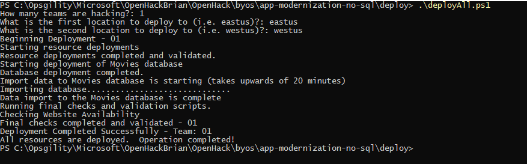

# Application Modernization with NoSQL OpenHack

## Permissions 

## Setting up Permissions

Before continuing ensure you understand the permissions needed to run the OpenHack on your Azure subscription.

**Initial Setup** 

To perform the setup and deployment to prepare for the OpenHack you must be be assigned to the Owner role on the Azure subscription(s).

To validate this, navigate to the <a href="https://portal.azure.com" target="_blank">Azure Portal</a>. Click on **All Services** -> **Subscriptions** -> **Access Control (IAM)**.

Enter the email address in the **Check access** text box to view the current permissions of the user performing the setup.  


**Performing the OpenHack** 

Each attendee in the OpenHack will be assigned the **Owner** role on a resource group unique to their team. This is covered later in this document in the deployment section.

## Common Azure Resources 

The following is a list of common Azure resources that are deployed and utilized during the OpenHack. 
Ensure that these services are not blocked by Azure Policy.  As this is an OpenHack, the services that attendees can utilize are not limited to this list so subscriptins with a tightly controlled service catalog may run into issues if the service an attendee wishes to use is disabled via policy.


| Azure resource           | Resource Providers |
| ------------------------ | --------------------------------------- | 
| Azure Cognitive Services | Microsoft.CognitiveServices             |
| Azure Cognitive Search   | Microsoft.Search                        |
| Azure Functions          | Microsoft.Web                           |
| Azure App Service        | Microsoft.Web                           |
| Azure Logic Apps         | Microsoft.Logic                         |
| Azure Storage            | Microsoft.Storage                       |
| Azure Machine Learning   | Microsoft.MachineLearningServices       |
| Azure Cosmos Db          | Microsoft.DocumentDb                    |
| Data Factory             | Microsoft.DataFactory                   |
| Event Hub                | Microsoft.EventHub                      |
| Event Grid               | Microsoft.EventGrid                     |
| Azure Cache for Redis    | Microsoft.Cache                         |
| Power BI                 | Microsoft.PowerBI                       |
| HDInsight                | Microsoft.HDInsight                     |
| Azure Databricks         | Microsoft.Databricks                    | 
| Azure Stream Analytics   | Microsoft.StreamAnalytics               |


> Note:  Resource Provider Registration can be found at https://portal.azure.com/_yourtenantname_.onmicrosoft.com/resource/subscriptions/_yoursubscriptionid_/resourceproviders

## Attendee Computers

Attendees will be required to install software on the workstations that they are performing the OpenHack on. Ensure they have adequate permissions to perform software installation. 

## Deployment Instructions 

For deployment, you will run a powershell script that executes an ARM template to setup the appropriate Resource Group for each team.  You will then manually add team members as owners to the resource group.  

### Traditional Powershell ###

If you want, you can just open a Powershell 7 Window

1. Navigate to the directory that contains the `deployAll.ps1` script with typical commands such as  

    ```  
    cd C:\the-root-path\...\byos\app-modernization-no-sql\deploy
    ```  
      

2. Ensure you are logged in.  

    Run the following command to connect:  

    ```  
    Connect-AzAccount
    ```  

    Follow the prompts to connect with the code in your browser.  When you are done, the subscription you are on will be listed.  

      

3. Ensure you are in the correct subscription (if the subscription listed after connecting is not the one you want to use).  If you are in the correct subscription, go to step 4.  

    Run the command  

    ```  
    Get-AzSubscription
    ```  

      

    Review the listed subscriptions to find the Id of the subscription you want to use.  

    Copy the subscription id, then run the command

    ```  
    Select-AzSubscription replace-with-your-sub-id
    ```  

        

4. Run the script `deployAll.ps1`    
    
    You will only need to input the number of teams and the two regions you want to deploy to and the script.  

      
    
    >Note: The script will take some time to run, and if you have more than one team it will have to run multiple iterations.  If you are re-deploying, you will be prompted to replace existing resource groups.  This takes a bit longer.  

    If the database import does not run synchronously, you will get an error on the final validation.  At this point, all resources are deployed, you just don't have data, so even though the deployment failed, you would just need to use script 3 to import the data and script 4 to then validate it worked (or just look at the website on the publicly exposed url).  

      

## Deployment artifacts / Validation

After deployment has completed, you should see the following resources:

- Resource group 1 ("nosql-XX-openhack1") where XX is the team number (i.e. "nosql-03-openhack1")

  - Event Hubs Namespace with an event hub named `telemetry`
  - SQL Server with firewall settings set to allow all Azure services and IP addresses from 0.0.0.0 - 255.255.255.255
  - Azure SQL Database named `Movies`
  - App Service containing the deployed web app with a SQL connection string added to the Configuration settings

- Resource group 2 ("nosql-XX-openhack2") (i.e. "nosql-03-openhack2")

  - Event Hubs Namespace with an event hub named `telemetry`

> [Download the zip file](https://databricksdemostore.blob.core.windows.net/data/nosql-openhack/DataGenerator.zip) for the data generator used in the OpenHack.

## Common Resources and Quotas needed

Resources users will create/provision/interact with:
* CosmosDb
    * Regular or Mongo recommended, others available but not as easy

* Azure Data Factory
    * Migration of data needs to be repeatable and needs to denormalize the data

* Event Hub

* Spark/Databricks/HDInsight/Stream Analytics

* Redis Cache

* Power BI 
    * for dashboard reporting

* Azure Functions

* Azure App Service for Function App

* Azure Logic Apps

* Azure Cognitive Search / Elastic Search
