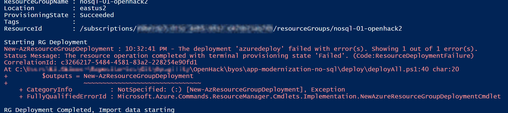
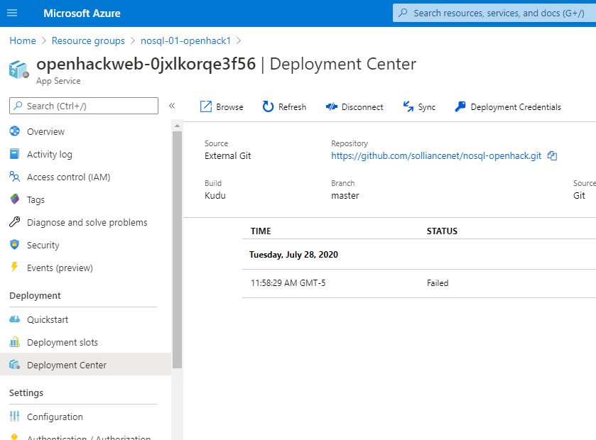

# Application Modernization with NoSQL OpenHack

## Permissions 

## Setting up Permissions

Before continuing ensure you understand the permissions needed to run the OpenHack on your Azure subscription.

**Initial Setup** 

To perform the setup and deployment to prepare for the OpenHack you must be be assigned to the Owner role on the Azure subscription(s).

To validate this, navigate to the <a href="https://portal.azure.com" target="_blank">Azure Portal</a>. Click on **All Services** -> **Subscriptions** -> **Access Control (IAM)**.

Enter the email address in the **Check access** text box to view the current permissions of the user performing the setup.  


**Performing the OpenHack** 

Each attendee in the OpenHack will be assigned the **Owner** role on a resource group unique to their team. This is covered later in this document in the deployment section.

## Common Azure Resources 

The following is a list of common Azure resources that are deployed and utilized during the OpenHack. 
Ensure that these services are not blocked by Azure Policy.  As this is an OpenHack, the services that attendees can utilize are not limited to this list so subscriptins with a tightly controlled service catalog may run into issues if the service an attendee wishes to use is disabled via policy.


| Azure resource           | Resource Providers |
| ------------------------ | --------------------------------------- | 
| Azure Cognitive Services | Microsoft.CognitiveServices             |
| Azure Cognitive Search   | Microsoft.Search                        |
| Azure Functions          | Microsoft.Web                           |
| Azure App Service        | Microsoft.Web                           |
| Azure Logic Apps         | Microsoft.Logic                         |
| Azure Storage            | Microsoft.Storage                       |
| Azure Machine Learning   | Microsoft.MachineLearningServices       |
| Azure Cosmos Db          | Microsoft.DocumentDb                    |
| Data Factory             | Microsoft.DataFactory                   |
| Event Hub                | Microsoft.EventHub                      |
| Event Grid               | Microsoft.EventGrid                     |
| Azure Cache for Redis    | Microsoft.Cache                         |
| Power BI                 | Microsoft.PowerBI                       |
| HDInsight                | Microsoft.HDInsight                     |
| Azure Databricks         | Microsoft.Databricks                    | 
| Azure Stream Analytics   | Microsoft.StreamAnalytics               |


> Note:  Resource Provider Registration can be found at https://portal.azure.com/_yourtenantname_.onmicrosoft.com/resource/subscriptions/_yoursubscriptionid_/resourceproviders

## Attendee Computers

Attendees will be required to install software on the workstations that they are performing the OpenHack on. Ensure they have adequate permissions to perform software installation. 

## Deployment Instructions 

For deployment, you will run a powershell script that executes an ARM template to setup the appropriate Resource Group for each team.  You will then manually add team members as owwers to the resource group.

1. Open a **PowerShell ISE** window, run the following command, if prompted, click **Yes to All**:

   ```PowerShell
   Set-ExecutionPolicy -Scope Process -ExecutionPolicy Bypass
   ```

2. Make sure you have the latest PowerShell Azure module installed by executing the following command:

    ```PowerShell
    Install-Module -Name Az -AllowClobber -Scope CurrentUser
    ```

3. If you installed an update, **close** the PowerShell ISE window, then **re-open** it. This ensures that the latest version of the Az module is used.

4. Execute the following to sign in to the Azure account:

    ```PowerShell
    Connect-AzAccount
    ```

5. Open the `app-modernization-no-sql\deploy\deployAll.ps1` PowerShell script in the PowerShell ISE window and update the following variables:

    > **Note**: The hosted Azure subscriptions do not support deploying SQL Server to all locations. You can use the Create Resource form in the portal while signed in as a class user, select SQL Database, select new SQL Server, then select locations in the dropdown list until you've identified the ones that don't cause a "this location is not supported" alert.  Use those locations during deployment.

    ```PowerShell
    # Enter the SQL Server username (i.e. openhackadmin)
    $sqlAdministratorLogin = "openhackadmin"
    # Enter the SQL Server password (i.e. Password123)
    $sqlAdministratorLoginPassword = "Password123"
    ```

    ```PowerShell
    #Additionally, you can just set the variables for location if you would prefer, rather than reading them from during the script execution by changing the following lines:
    $location1 = Read-Host "What is the first location to deploy to (i.e. eastus)?";  
    $location2 = Read-Host "What is the second location to deploy to (i.e. westus)?"

    #to
    $location1 = "eastus"; #or another region
    $location2 = "westus"; #or another region
    ```

6. Press **F5** to run the script, this will do the following:

   - Deploy the ARM template
   - Restore the Azure SQL database from a `.bacpac` file
   - Deploy the sample web app

7. If you receive an error during the ARM template deployment for `Resource Microsoft.Web/sites/sourcecontrols`, with an error code of `ResourceDeploymentFailure` and message stating `The resource operation completed with terminal provisioning state 'Failed'.`, this means the automated web app deployment from GitHub failed. This is most likely due to a timeout during the NuGet package restore process.

     

    If you see this message, perform the following steps:

    1. Log in to the Azure portal (<https://portal.azure.com>) with the account used for your deployment.
    2. Open the `resourceGroup1Name` resource group (default is "nosql-XX-openhack1").
    3. Open the App Service whose name starts with "openhackweb-".
    4. Select **Deployment Center** in the left-hand menu. Most likely, the deployment status will display as "Failed". Select **Sync** to initiate a new build from the connected GitHub repo. If the status shows as Failed again, select the Logs link to view the latest logs.



## Deployment artifacts / Validation

After deployment has completed, you should see the following resources:

- Resource group 1 ("nosql-XX-openhack1") where XX is the team number (i.e. "nosql-03-openhack1")

  - Event Hubs Namespace with an event hub named `telemetry`
  - SQL Server with firewall settings set to allow all Azure services and IP addresses from 0.0.0.0 - 255.255.255.255
  - Azure SQL Database named `Movies`
  - App Service containing the deployed web app with a SQL connection string added to the Configuration settings

- Resource group 2 ("nosql-XX-openhack2") (i.e. "nosql-03-openhack2")

  - Event Hubs Namespace with an event hub named `telemetry`

> [Download the zip file](https://databricksdemostore.blob.core.windows.net/data/nosql-openhack/DataGenerator.zip) for the data generator used in the OpenHack.


## Additional ##
## Common Resources and Quotas needed

Resources users will create/provision/interact with:
* CosmosDb
    * Regular or Mongo recommended, others available but not as easy

* Azure Data Factory
    * Migration of data needs to be repeatable and needs to denormalize the data

* Event Hub

* Spark/Databricks/HDInsight/Stream Analytics

* Redis Cache

* Power BI 
    * for dashboard reporting

* Azure Functions

* Azure App Service for Function App

* Azure Logic Apps

* Azure Cognitive Search / Elastic Search
