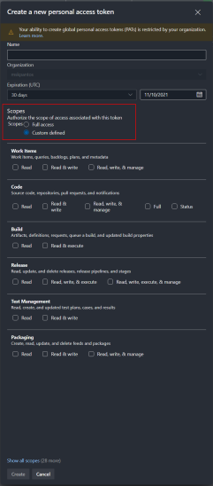
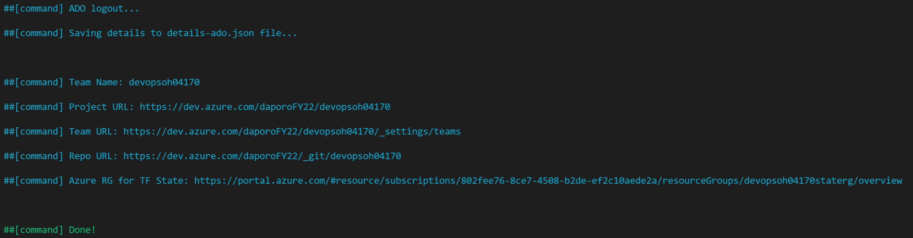

# DevOps OpenHack Deployment for Azure DevOps

## Setting up permissions

Before continuing, ensure you understand the permissions needed to run the OpenHack on your Azure subscription and your Azure DevOps organization.

This lab deploys to a single resource group within an Azure subscription. To deploy this lab environment, ensure the account you use to execute the script got the Azure Owner Role.

## Prerequisites

- [Azure Subscription](https://azure.microsoft.com/) with [Owner](https://docs.microsoft.com/en-us/azure/role-based-access-control/built-in-roles) role
- [Azure DevOps organization](https://docs.microsoft.com/en-us/azure/devops/organizations/accounts/create-organization?view=azure-devops) with [Project Collection Administrators](https://docs.microsoft.com/en-us/azure/devops/organizations/security/look-up-project-collection-administrators?view=azure-devops#show-members-of-the-project-collection-administrators-group) membership
- Linux Bash ([Windows Subsystem for Linux (WSL)](https://docs.microsoft.com/en-us/windows/wsl/) works too)
- [Azure CLI 2.34.1](https://docs.microsoft.com/en-us/cli/azure/install-azure-cli-linux) or higher
- [jq 1.5](https://stedolan.github.io/jq/download/) or higher

> **NOTE** [Azure Cloud Shell](https://docs.microsoft.com/en-us/azure/cloud-shell/overview) is **supported** for the Azure DevOps deployment scenario and it's recommended solution.

> **NOTE:** If your team consists only Microsoft employees, and you have chosen Azure DevOps, then use only Microsoft tenant for new ADO organization

## Expected resources

### azuresp.json

The `deploy-ado.sh` script creates `azuresp.json` file with Service Principal credentials. Service Principal has **Owner** role, and it's dedicated for the OpenHack only.

> **NOTE** Please keep this file for future use by your team members.

### Azure

| Azure resource        | Pricing tier/SKU | Purpose                            | Registered Resource Providers |
| --------------------- | ---------------- | ---------------------------------- | ----------------------------- |
| Azure Resource Group  | N/A              | Resource Group for Terraform state | N/A                           |
| Azure Storage Account | Standard_LRS     | Storage for Terraform state        | Microsoft.Storage             |

### Azure DevOps

| Azure DevOps resource | Name                           | Purpose                                                                 |
| --------------------- | ------------------------------ | ----------------------------------------------------------------------- |
| Project               | N/A                            | Project for team members                                                |
| Repository            | N/A                            | Git repository with OpenHack files                                      |
| Service Connection    | AzureServiceConnection         | Service Connection for AzureRM with Service Principal from azuresp.json |
| Variable              | LOCATION                       | Variable with Azure location for resources                              |
| Variable              | RESOURCES_PREFIX               | Variable with Resources Prefix used for resources                       |
| Variable              | TFSTATE_RESOURCES_GROUP_NAME   | Variable with Resource Group for Terraform state                        |
| Variable              | TFSTATE_STORAGE_ACCOUNT_NAME   | Variable with Storage Account for Terraform state                       |
| Variable              | TFSTATE_STORAGE_CONTAINER_NAME | Variable with Storage Container for Terraform states                    |
| Variable              | TFSTATE_KEY                    | Variable with State Key for Terraform state                             |

## Deployments Steps

### Azure pre-deployment steps

Open Cloud Shell.

Go to: [shell.azure.com](https://shell.azure.com)

Login to your Azure Subscription (You can skip this step if you are using Cloud Shell for deployment).

```bash
az login
```

Make sure your login context uses the correct Azure Subscription.

```bash
az account show
```

If not, then change to your Azure Subscription dedicated for the OpenHack.

```bash
az account set --subscription <subscriptionId>
```

Verify your account permissions for the subscription. Expected value: `Owner`.

```bash
az role assignment list --assignee $(az account show --output tsv --query user.name) --output tsv --query [].roleDefinitionName --include-inherited
```

### Azure DevOps pre-deployment steps

(optional) Create a new Azure DevOps organization. Follow this guide on how to do it: [Create an organization](https://docs.microsoft.com/en-us/azure/devops/organizations/accounts/create-organization?view=azure-devops#create-an-organization)

> **NOTE** New Azure DevOps organization dedicated only for the OpenHack is highly recommended!

Login to your [Azure DevOps](https://dev.azure.com) organization and [Create a Personal Access Token](https://docs.microsoft.com/en-us/azure/devops/organizations/accounts/use-personal-access-tokens-to-authenticate?view=azure-devops&tabs=preview-page#create-a-pat) with scope: 

```
Build: Read & execute
Code: Full
Extensions: Read & manage
Marketplace: Acquire
Project and Team: Read, write, & manage
Release: Read, write, execute, & manage
Service Connections: Read, query, & manage
Variable Groups: Read, create, & manage
```

Then set environment variable `AZURE_DEVOPS_EXT_PAT` with the generated token.

> **NOTE**
>
> You can customize the access rights the PAT will have by selecting the Custom Defined scope option as shown in the following picture.
>
> 
>
> Make source you assign the rights to create the resources mentioned at Azure DevOps resources table.

```bash
export AZURE_DEVOPS_EXT_PAT="<AzureDevOpsPAT>"
```

### Deployment

Clone GitHub repo with BYOS resources.

```bash
git clone https://github.com/microsoft/OpenHack.git
```

Go to DevOps OpenHack deployments scripts.

```bash
cd OpenHack/byos/devops/deploy
```

Make deployment script executable.

```bash
chmod +x deploy-ado.sh
chmod +x semver2.sh
```

Run `deploy-ado.sh` bash script to start Azure & Azure DevOps configuration.

> **NOTE**
>
> For Azure Location, please use the exact location where your Azure DevOps organization has deployed.
>
> If you are unsure, go to the Organization Settings page and check Region value.
>
> Organization Settings page: `https://dev.azure.com/<YourAdoOrgName>/_settings`
>
> **IMPORTANT!**
>
> The deploy script contains optional parameters `-t <TeamName> -a <AzureDeployment>`. Please keep default parameters and do not set yours for official OpenHack events. However, you can adjust them to your needs for self-paced independent runs.

```bash
./deploy-ado.sh -l <AzureLocation> -o <AdoOrgName>
```

> **NOTES**
>
> ADO supported regions and thus valid arguments for `AzureLocation` are:
>
> - centralus
> - uksouth
> - eastasia
> - southeastasia
> - brazilsouth
> - canadacentral
> - australiaeast
> - westeurope
> - westus2
>
> **Defaults for optional parameters**
>
> -t TeamName = randomly generated number with 5 digits
>
> -a AzureDeployment = true (deploy Azure resources, if false, then just configure Azure DevOps)

Example end of the output from `deploy-ado.sh` script



### Azure post-deployment steps

Add OpenHack team members to Azure Subscription with **Contributor** role, follow guide: [Assign Azure roles using the Azure portal
](https://docs.microsoft.com/en-us/azure/role-based-access-control/role-assignments-portal)

#### Azure DevOps hosted agents availability limitation

According to Azure Pipelines Grant announcements for [private](https://devblogs.microsoft.com/devops/change-in-azure-pipelines-grant-for-private-projects/) and [public](https://devblogs.microsoft.com/devops/change-in-azure-pipelines-grant-for-public-projects/) project, you may not be able to access hosted agents.

##### Solution 1 - Purchase parallel jobs

Setup [DevOps Organizational billing](https://docs.microsoft.com/en-us/azure/devops/organizations/billing/set-up-billing-for-your-organization-vs?view=azure-devops) with your Azure Subscription, and [purchase parallel jobs](https://docs.microsoft.com/en-us/azure/devops/pipelines/licensing/concurrent-jobs?view=azure-devops&tabs=ms-hosted#how-do-i-buy-more-parallel-jobs) for your pipeline(s).

##### Solution 2 - VM Scale Set

The deployment script deploys private agents based on [VM Scale Set](https://docs.microsoft.com/en-us/azure/devops/pipelines/agents/scale-set-agents?view=azure-devops) (Windows & Linux). So your role is just to create agent pools, and attach provisioned VMSS based on this guide: [Create the scale set agent pool](https://docs.microsoft.com/en-us/azure/devops/pipelines/agents/scale-set-agents?view=azure-devops#create-the-scale-set-agent-pool)

### Azure DevOps post-deployment steps

Add OpenHack team members to Azure DevOps Project Team, follow guide: [Add users or groups to a team](https://docs.microsoft.com/en-us/azure/devops/organizations/security/add-users-team-project?view=azure-devops&tabs=preview-page#add-users-or-groups-to-a-team)
