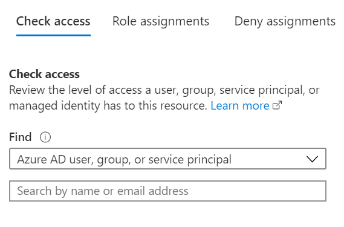

# AI-Powered Knowledge Mining OpenHack 

## Setting up Permissions

Before continuing ensure you understand the permissions needed to run the OpenHack on your Azure subscription.

**Initial Setup** 

To perform the setup and deployment to prepare for the OpenHack you must be be assigned to the Owner role on the Azure subscription(s).

To validate this, navigate to the <a href="https://portal.azure.com" target="_blank">Azure Portal</a>. Click on **All Services** -> **Subscriptions** -> **Access Control (IAM)**.

Enter the email address in the **Check access** text box to view the current permissions of the user performing the setup.  



**Performing the OpenHack** 

Each attendee in the OpenHack will be assigned the **Owner** role on a resource group unique to their team. This is covered later in this document in the deployment section.


## Common Azure Resources 

The following is a list of common Azure resources that are deployed and utilized during the Open Hack. 
Ensure that these services are not blocked by Azure Policy.  As this is an OpenHack, the services that attendees can utilize are not limited to this list so subscriptions with a tightly controlled service catalog may run into issues if the service an attendee wishes to use is disabled via policy.


| Azure resource           | Resource Providers |
| ------------------------ | --------------------------------------- | 
| Azure Cognitive Services | Microsoft.CognitiveServices         |
| Azure Search             | Microsoft.Search                    |
| Azure Functions          | Microsoft.Web                       |
| Azure App Service        | Microsoft.Web                       |
| Azure Storage            | Microsoft.Storage                   |
| Azure Machine Learning   | Microsoft.MachineLearningServices   |


## Attendee Computers

Attendees will be required to install software on the workstations that they are performing the OpenHack on. Ensure they have adequate permissions to perform software installation. 

## Deployment Instructions 

For deployment, you will run a powershell script that executes an ARM template to setup the appropriate Resource Group for each team.  You will then manually add team members as owwers to the resource group.


1. Open a **PowerShell ISE** window, run the following command, if prompted, click **Yes to All**:

   ```PowerShell
   Set-ExecutionPolicy -Scope Process -ExecutionPolicy Bypass
   ```

2. Make sure you have the latest PowerShell Azure module installed by executing the following command, if prompted, click **Yes to All**:

    ```PowerShell
    Install-Module -Name Az -AllowClobber -Scope CurrentUser
    ```

3. If you installed an update, **close** the PowerShell ISE window, then redo **Step 1.**. This ensures that the latest version of the Az module is used.

4. Execute the following to sign in to the Azure account that has the **Owner** role assignment.

    ```PowerShell
    Connect-AzAccount
    ```

5. Open the `knowledge-mining\deploy\deployAll.ps1` PowerShell script in the PowerShell ISE window.  There is **nothing** to update, but if you wanted you ***could*** set the location and not require the read-in from the prompt.:

    ```PowerShell
    $region = Read-Host "What Region Resources be deployed to (i.e. centralus, southcentralus, japaneast, etc)?";
    #could be
    $region = "centralus"
    ```

6.  Press **F5** to run the script, this will do the following:

   * Create resource group entitled **KMOpenHackRG[XX]-[location]** where XX is the two-digit team number and location is the location you entered or have in the script.  For example, team 2 in southcentralus would have rg **KMOpenHackRG02-southcentralus**

### Manual step - Assigning Users to Each Resource Group 

After deployment, manually add the appropriate users with owner access on the appropriate resource group for their team. 

See the following for detailed instructions for assigning users to roles.

[Add or remove Azure role assignments using the Azure portal](https://docs.microsoft.com/en-us/azure/role-based-access-control/role-assignments-portal)


## Validate 
Resource Groups exist for each of the Teams, members are in each team appropriately with owner permission on the resource group.

Prerequisites/other things to check:

* Relies on third-party docs found here: https://aka.ms/kmoh-docs

* Relies on access and ability to configure/work with multiple Cognitive services, including Azure Search, Form Recognition, Machine Learning, LUIS

* Teams need to be able to work independently of each other in Azure Cognitive services to accomplish the stated goal.


### More detail on the usage of the services

* Cognitive services  
    * QnA Maker  
        * ability to provision this service in the subscription - per team
    * OCR
        * extract text from documents

* Azure Search (Azure Cognitive Search)
    * Create a datasource, index, and indexer for the website documents provided
    * Create skillsets in search
    * Create Custom Skills Web Service
        * Trial Resource is free
        * Bing Entity Search Resource - free layer at the subscription for a few days

* Azure Functions
    * Create and provision functions

* Azure App Service
    * Function apps
    

* Azure Storage w/Blob Container
    * Ability to index blobs

* Language Understanding Intelligence Service (LUIS) 
    * Be able to define intents

* Form Recognizer service
    * In this challenge, you'll create a custom skill that leverages the *Form Recognizer* Service to get insights from the form-based data by extracting key-value pairs that describe each form field and the value it contains.

        * > **Important**: At the time of writing, Form Recognizer is available as a restricted preview for which your Azure subscription must be explicitly registered. The subscriptions provided as part of this OpenHack **have already been registered**. If you want to try the service using your own Azure subscription, you must [request access](https://docs.microsoft.com/en-us/azure/cognitive-services/form-recognizer/overview#request-access).

        * > During the preview, to create an instance of the Form Recognizer service, you must sign into your approved subscription in the Azure portal using [this link](https://portal.azure.com/?microsoft_azure_marketplace_ItemHideKey=microsoft_azure_cognitiveservices_formUnderstandingPreview#create/Microsoft.CognitiveServicesFormRecognizer).

* Azure Machine Learning
    * Publish said model as a webservice
    * Add custom skill indexers to populate claim probability

* One or more of the following:
    * Visual Studio - C# path
        * Azure Development Workload

    * VS Code / Python & Javascript and node / other development scripts
        * Azure Functions Extensions

* Postman
