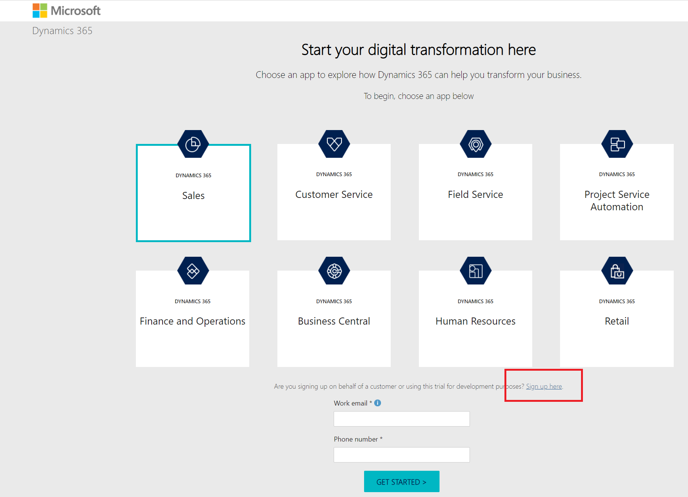
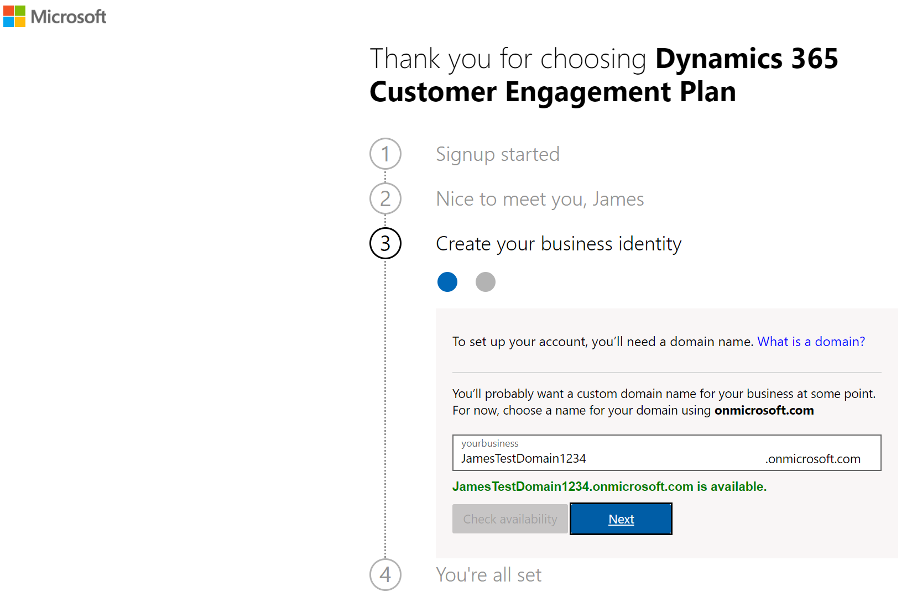
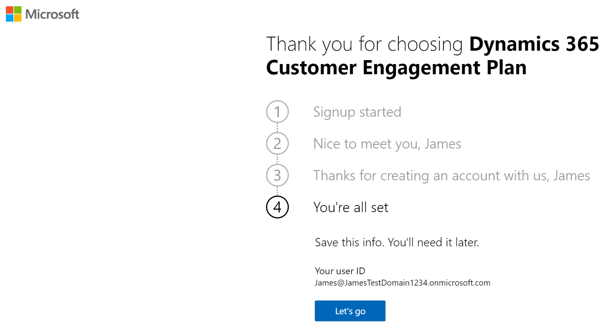
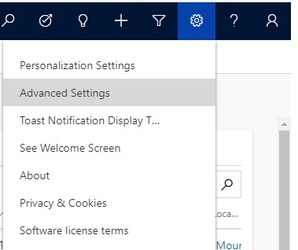
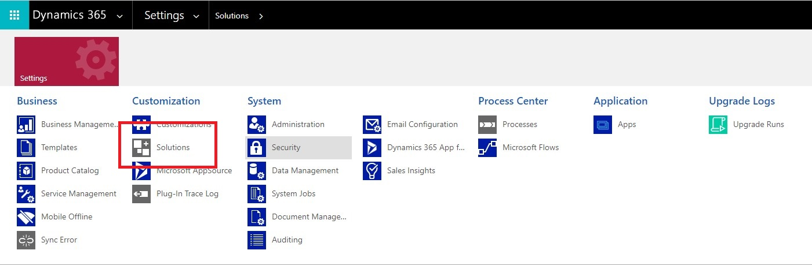

# Overview

# Environment Setup

There are three available options for obtaining an environment to
complete the Dynamics 365 + Power Platform OpenHack: 
1. Provide attendees a pre-configured environment
2. Advise attendees on [how to spin up a 30-day
trial environment](#option-2-30-day-trial-environment)
3. Have them bring their own subscription (BYOS).

This document will focus on the latter two.

## Bill of Materials

The following are required in order to successfully complete the
Dynamics 365 + Power Platform OpenHack:
-   Subscriptions (Trials subscriptions will work)
    -   M365 E3 subscription (*non-Microsoft tenant recommended*)
    -   Power BI Pro subscription
    -   AI Builder subscription
-   Solutions
    -   Dynamics 365 Healthcare Accelerator ([installed via AppSource](https://appsource.microsoft.com/en-us/product/dynamics-365/msemr.healthcarecommondatamodel?tab=Overview))
    -   [PowerPlatformOpenHacks.zip (Managed Solution)](deployment/PowerPlatformOpenHackThings.zip?raw=true)
        -   *Contains*:
            -   Dynamics 365 Views for Appointment EMR entity
            -   Field name changes for Appointment EMR entity
            -   Site Map edits for D365 Healthcare Accelerator
        -   To install: In Dynamics 365, go to Advanced Settings
            Solutions Import
-   Applications
    -   Power BI Desktop

## Option 2: 30-day Trial Environment

### How to set up a Dynamics 365 Trial and create your Power Platform tenant

1.  Open a web browser and navigate to trials.dynamics.com and click
    **"Sign up here"** (Don't click "Get Started").

    > Note: *If you are already logged in with another Microsoft 365 account, you
    may need to open an incognito browser.*

    

1.  You will get a pop-up asking you if you are a partner or Microsoft
    employee. Always try to be honest, but in this case we're going to
    click "no and continue signing up" so that we can see the full
    experience.

    

1.  Enter your email address, then provide the necessary information
    required. You must provide a phone number where you can either be
    texted or called with a verification code to prove that you are not
    a robot.

    

1.  Once the code is verified, you will be able to create your new
    domain, which will be the unique name used to identify your Dynamics
    365 tenant. Finish creating your business identity user and sign up.

    

1.  You will then be able to navigate to your newly created tenant.

    

1.  Select at least one first party app to get started with (you can
    select more later if you wish). This will complete your setup.

    *\*You could also select none if none of these apps meet your business needs.*

    

1.  You will then be navigated to your newly created tenant. From here,
    you can open the menu in the upper left-hand corner to navigate to
    the Admin center to continue your setup.

    

### Installing Dynamics Health Care Accelerator
1. Install the [Dynamics 365 Healthcare Accelerator from AppSource](https://appsource.microsoft.com/en-us/product/dynamics-365/msemr.healthcarecommondatamodel?tab=Overview) into the tenant and environment you created in the previous section. 
    > Note: The D365 Healthcare Accelerator may take up to an hour to install.  It also comes with sample data that may not install on the first try.

1.  Go to admin.powerplatform.com

1.  Select the appropriate environment then click **Resources >> Dynamics 365 apps**

1.  Find Dynamics 365 Electronic Medical Records and Dynamics Healthcare
    Accelerator Sample Data

    

1.  Make sure both are installed.

### Installing Power Platform OpenHack Content

1. Import the **PowerPlatformOpenHacks.zip** (Managed Solution) extracted from the [PowerPlatformOpenHackThings.zip](deployment/PowerPlatformOpenHackThings.zip?raw=true) by going to Advanced Settings >> Solutions in Dynamics.

    

## Option 3: Bring You Own Subscription 

If you decide to bring your own subscription, you will need two
environments (one for Dev, one for "Prod") to complete the OpenHack
challenges. You will need the following Bill of Materials installed in
each environment:

-   Solutions

    -   Dynamics 365 Healthcare Accelerator ([installed via AppSource](https://appsource.microsoft.com/en-us/product/dynamics-365/msemr.healthcarecommondatamodel?tab=Overview))

    -   [PowerPlatformOpenHacks.zip (Managed Solution)](deployment/PowerPlatformOpenHackThings.zip?raw=true)

        -   *Contains*:

            -   Dynamics 365 Views for Appointment EMR entity

            -   Field name changes for Appointment EMR entity

            -   Site Map edits for D365 Healthcare Accelerator

        -   To install: In Dynamics 365, go to Advanced Settings Solutions Import

-   Subscriptions (Trials subscriptions will work)

    -   Office 365 E3 subscription

    -   Power BI Pro subscription

    -   AI Builder subscription

-   Applications

    -   Power BI Desktop
