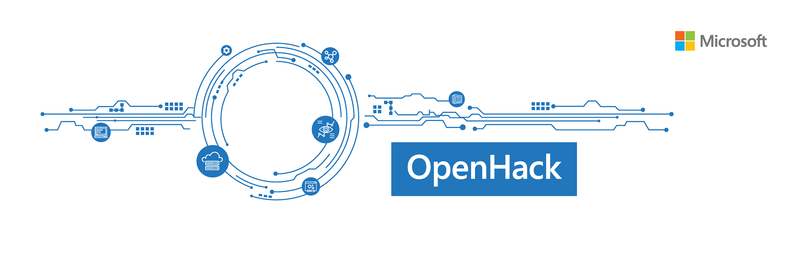

# Microsoft OpenHack 

## Instructions for deploying to your own subscription

This document outlines the steps necessary to allow customers to use their own Azure subscriptions for OpenHack. 

1.	Create / locate Azure subscription(s) following a few general requirements
2.	Do a quick <a href="https://microsoft.sharepoint.com/teams/OpenHack/_layouts/15/Doc.aspx?sourcedoc=%7bffdcfb77-8093-497c-a256-2aa18e7518e6%7d&action=edit&wd=target%28Lead%20Coach.one%7C88379f2b-d015-4cf5-9d2b-cdd705839c77%2FLead%20Coach%20Tasks%7Cce881bc5-2223-47ac-95d7-083513afcff2%2F%29" target='_blank'>review of overall responsibilities</a> for running an OpenHack as a Technical Lead of the event
3.	Use <a href="https://microsoft-my.sharepoint.com/:w:/p/nirshah/EXz9ACdUGwZMn0c1ZjE7eAYBxXJzN6mWmVwfO8SeTMweCA?e=2NfCl9" target="_blank">guidance</a> to check Azure datacenter capacity for the OpenHack event
4.	Setup hacking environment with OpenHack topic-specific requirements
5.	Start the content / labs in the Opsgility portal
6.	Support will be provided if you have any issues with your OpenHack environment set-up at openhacks@opsgility.com 

### Timing Alert
Setup of environment may take extensive time depending on the OpenHack topic you are running. For safe measure, please start running the OpenHack on your Azure subscription(s) at least 48 hours before the kickoff of the event. 

## OpenHack Specific Guidance

- [AI-Powered Knowledge Mining](knowledge-mining/deployment.md)
- [App Modernization with NoSQL](app-modernization-no-sql/deployment.md)
- [DevOps 2.0](devops-2.0/deployment.md)
- [Modern Data Warehousing](modern-data-warehousing/deployment.md)
- [Power Platform](power-platform.md/deployment.md)
- [Serverless](serverless/deployment.md)
