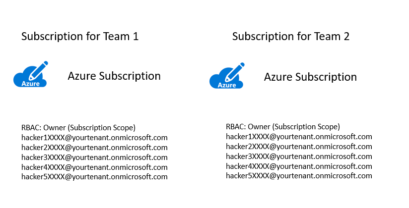
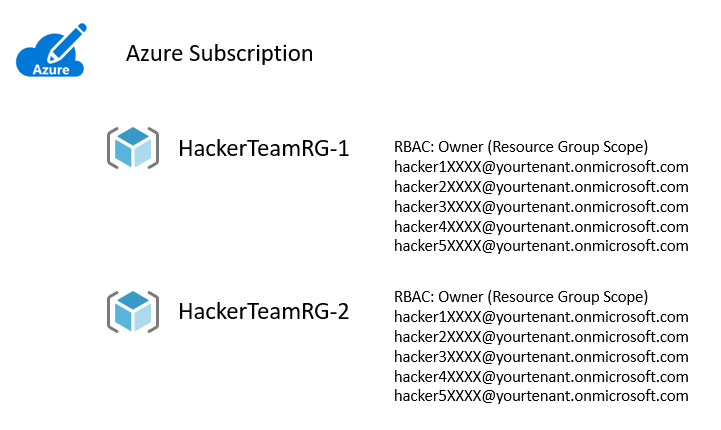

# Microsoft OpenHack Bring your Own Subscription (BYOS)

Bring your own subscription (BYOS) enables you to participate in a Microsoft OpenHack using your own Azure subscription(s). The documentation in this repository provides guidance on how to setup each OpenHack in your subscription as well as an overview of some of the differences you will see when interacting with the coach and attendee portals of OpenHack when using your own subscription.

**Contents**

<!-- TOC -->

- [Microsoft OpenHack Bring your Own Subscription BYOS](#microsoft-openhack-bring-your-own-subscription-byos)
    - [Timing Alert](#timing-alert)
    - [Azure Subscription Guidance](#azure-subscription-guidance)
        - [User and Team Structure](#user-and-team-structure)
        - [Azure Subscription Structure](#azure-subscription-structure)
    - [OpenHack Specific Deployment Guidance](#openhack-specific-deployment-guidance)
    - [OpenHack Portal Differences](#openhack-portal-differences)
        - [Cloud Sandbox Coach Portal](#cloud-sandbox-coach-portal)
        - [Attendee Portal](#attendee-portal)
    - [Questions?](#questions)

<!-- /TOC -->

## Timing Alert
Setup of environment may take extensive time depending on the OpenHack topic you are running. For safe measure, please start running the OpenHack on your Azure subscription(s) at least 48 hours before the kickoff of the event. 

## Azure Subscription Guidance

### User and Team Structure 

OpenHack participants work together as a team (usually around 5-6 people per team). In the diagrams below you will see user accounts specified as hackerXXXX@yourtenant.onmicrosoft.com. You can optionally use generated accounts in that format just for the OpenHack or you can use your users real user accounts. 

There are two common approaches for setting up subscriptions and permissions for an OpenHack.

### Azure Subscription Structure 

**Option 1: Azure subscription per team**

This approach provides ownership access at the subscription level for OpenHack participants. This approach is the most open and flexible method to allow attendees to use the widest range of tools at their disposal to complete the OpenHack. The tradeoff is attendees have full control over any resource that can be created in the subscription. 

**Option 2: Azure Resource Group per Team** 

This approach provides ownership access at the resource group level for each team participating in the OpenHack. This approach allows finer control of what attendees can/cannot do during the OpenHack. You can optionally apply policies to control which services are available at the subscription scope which are not overridable at the resource group level.

### Azure AD Permissions

Most OpenHacks do not require additional permissions in Azure AD. The Migration OpenHack is the current exception and requires Global Administrator permissions. It is **not recommended** to run this OpenHack in a production Azure AD tenant.

## OpenHack Specific Deployment Guidance

The following documents outline the permissions needed for each OpenHack, the most common resources that are created, as well deployment script documentation if the OpenHack has resources that should be created prior to the start. 

- [AI-Powered Knowledge Mining](knowledge-mining/deployment.md)
- [App Modernization with NoSQL](app-modernization-no-sql/deployment.md)
- [Containers](containers/deployment.md)
- [DevOps 2.0](devops-2.0/deployment.md)
- [DevOps for Data Science](devops-for-data-science/deployment.md)
- [Dynamics 365 + Power Platform](power-platform/deployment.md)
- [Iot Gateway Operations](iot-gatewayoperations/deployment.md)
- [Migration](migration/deployment.md)
- [Modern Data Warehousing](modern-data-warehousing/deployment.md)
- [Serverless](serverless/deployment.md)
- [Security, Compliance, and Identity](sci/sci-byos-env-setup.md)

## OpenHack Portal Differences

In a BYOS OpenHack, the Azure subscriptions are managed completely out of the Opsgility environment. The following, outlines the differences you will experience in the Cloud Sandbox/Coach Portal and the attendee portal in a BYOS OpenHack environment.

### Cloud Sandbox (Coach Portal)

The differences you will encounter on the Cloud Sandbox is as a Tech Lead or a Lead PM/Coach:

- You will no longer have the ability to start or end the lab environment. This is because the Azure subscriptions in a BYOS scenario are not controlled by the Cloud Sandbox. 
- You will not have the ability to view view the Azure credentials for the environments. Access to the Azure subscriptions must be managed in the Azure AD tenant you will use for the BYOS environment. 

### Attendee Portal

The difference you will encounter on the Attendee portal is you will not see the **View Lab Environment** tab with your Azure user credentials. Access to the Azure subscription in managed on the Azure AD tenant you will use for the BYOS environent.

## Questions?

- OpenHack Program: <a href="mailto:askohack@microsoft.com">Contact us @ AskOpenHack@microsoft.com</a>
- Opsgility Portals <a href="mailto:openhacks@opsgility.com">Contact us @ OpenHacks@opsgility.com</a>
